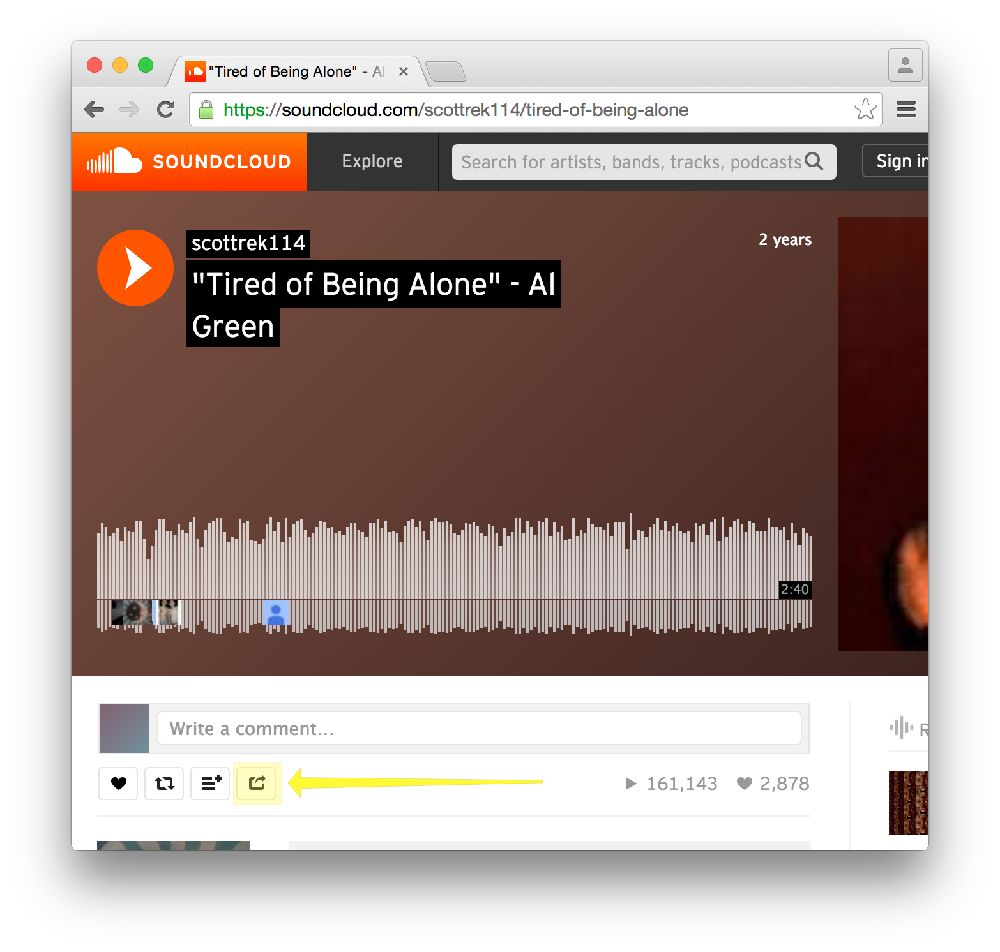
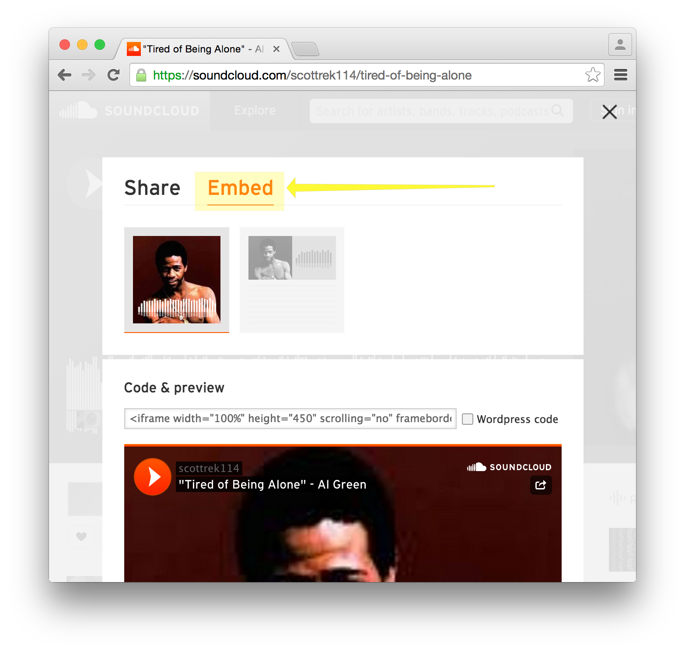
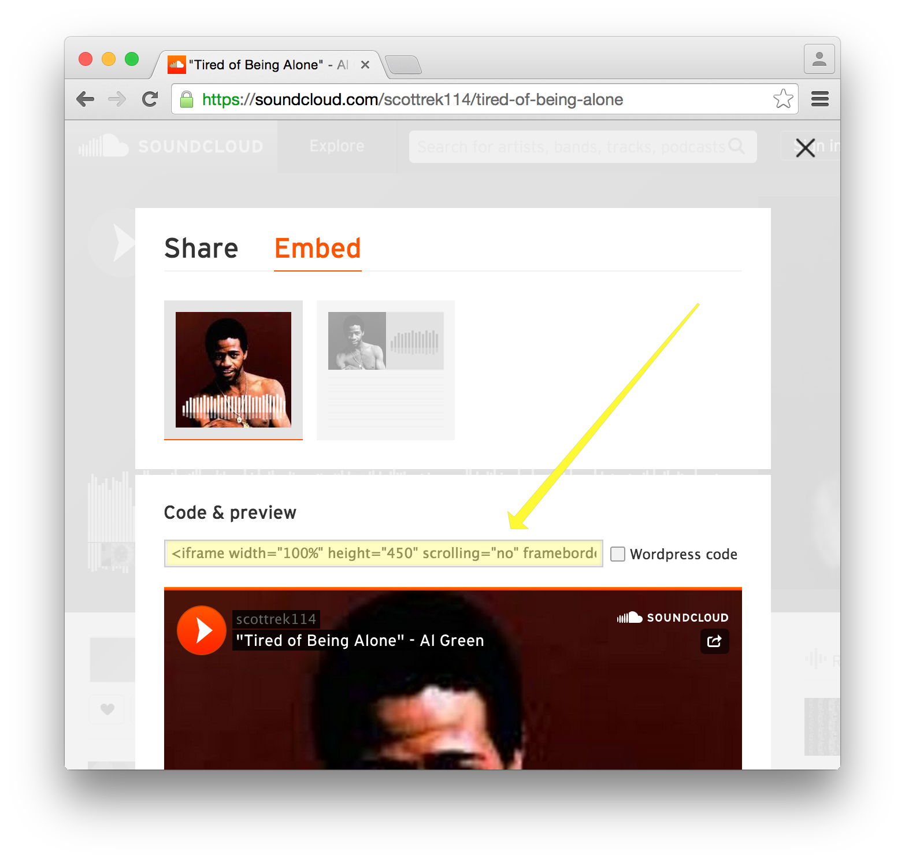
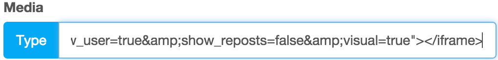

# Add a SoundCloud Clip

If you want to add a SoundCloud clip to your product, you need to find the 'embed' ID of the clip. How can you find this ID?

## Click on the share button of the clip 

{:.imageWidth}

## Click on 'Embed'

{:.imageWidth}

## Copy the HTML code

{:.imageWidth}

## Edit your product

Paste the HTML code into the media field. Oronjo will determine the media type and ID once you hit update.  

### Media field with HTML code

{:.imageWidth}

### Media field after update 

{:.imageWidth}
