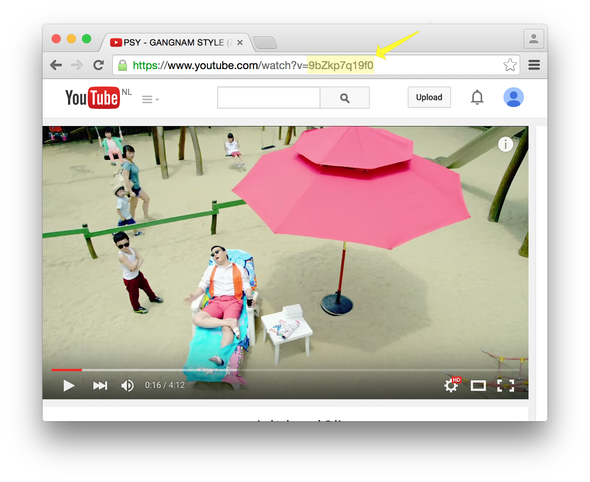
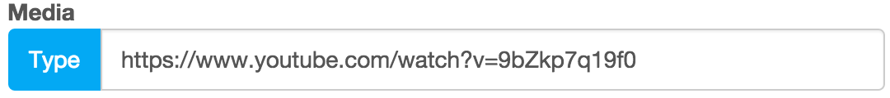

# Add a YouTube video

If you want to add a YouTube video to your product, you need to have the ID of the video. You can find the ID in the URL, for example:

{:.imageWidth}

## Find the ID in the URL

|                                                 |||||                    |  
| URL                                             ||||| ID                 |  
| ----------------------------------------------- ||||| -------------------|  
|                                                 |||||                    |  
| https://www.youtube.com/watch?v=**9bZkp7q19f0** |||||    **9bZkp7q19f0** |  
|                                                 |||||                    |  

## Use the ID in your product setup

Select YouTube as the media type and add the ID:

{:.imageWidth}

## Pro tip

You can also enter the complete URL into the media field, Oronjo will determine the media type and ID once you hit update.

{:.imageWidth}
